<!-- ============ HEADER ============ -->

  

  

---

### ✦ About me

Hi, I'm **Mora**. I'm a first-year **Data Science** student at **Universidad Austral** in Rosario, Argentina.
I like finding the story hidden in a dataset, and I'm especially drawn to the places where data meets
**biology** and **physics**: understanding living systems and the natural world through numbers.

- **Studying:** Bachelor's in Data Science (*Licenciatura en Ciencia de Datos*), 2026 – 2029 (expected)
- **Interested in:** data science applied to biology, life sciences and physics
- **Looking for:** mentorship from people working in data, science or research
- **Languages:** Spanish (native) · English (B2, preparing for Cambridge First)

---

### ✦ Experience

I've been working and taking on real responsibility from a young age, and it shaped how I study and work today:
I'm organized, reliable and used to staying calm when things get busy.

| Role | Duration | What I did |
|:--|:--|:--|
| **Kids' Party Coordinator** | 3 months · *Present* | Coordinate children's parties: manage schedules, run activities and solve problems on the spot. |
| **Childcare Supervisor** · Musical theatre school | 2 years | Supervised groups of children at a musical theatre institute, keeping them safe and engaged while working with families and staff. |

**Skills I built along the way:** leadership · communication · teamwork · responsibility · working under pressure

  

### ✦ Tech stack

  

**Currently learning**

  
  
  
  

---

### ✦ Projects

| Project | What it does | Built with |
|:--|:--|:--|
| [**Telegram Bot**](https://github.com/moravilar/REPO-NAME) | A Telegram bot that connects to external APIs and answers user requests. | Python · REST APIs · Telegram Bot API |
| [**Weather Data R Package**](https://github.com/moravilar/REPO-NAME) | A package of R functions for cleaning, summarizing and analyzing meteorological data. | R · RStudio |

More projects coming soon as I keep learning.

---

### ✦ Coursework

<b>Currently taking</b>

 

- **Applied Statistics**: hands-on statistical analysis with R
- **Programming II**: R and RStudio
- **Discrete Mathematics**
- **Internet Workshop II**: APIs and a Telegram bot built with Python
- **Economics**: micro and macro fundamentals applied to data science
- **Anthropology**

<b>Completed</b>

 

- **Programming I**: Python fundamentals
- **Mathematics for Machine Learning**: analytic mathematics foundations
- **Internet Workshop I**: web development with HTML, CSS and vanilla JavaScript
- **Introduction to Biomedical Sciences**: principles of clinical research
- **Philosophy**

---

### ✦ Beyond code

  

- **Musical theatre:** 15 years of acting, singing and dancing on stage
- **Music:** I play the piano and love to sing
- **Chess and video games:** I enjoy strategy in every form
- **Faith:** I'm a Christian and serve actively at my church. It's at the heart of who I am
- **Mate:** always within reach while I code

---

### ✦ GitHub stats

  
  

  

---

### ✦ Let's connect

  <i>Always learning, always curious. Feel free to reach out!</i>

  
  
  

<!-- ============ FOOTER ============ -->

  

